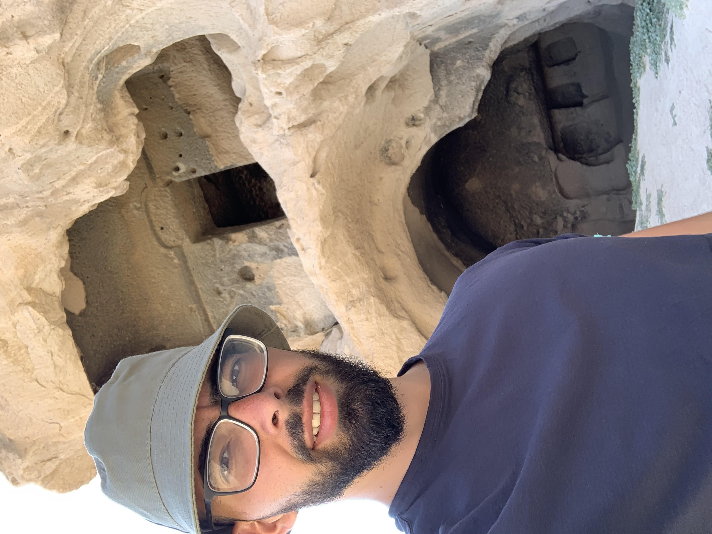

# Ozan Leon Yurdakul

 

## Main fact's about ME
- 👋 Hi, I’m @Ozanyurdakul98
- 🥸 I'm born in Austria but from Turkey and currently living in Germany
- 👀 I’m interested in good Web Development and a bright future full of Robots!
- 🌱 I’m currently learning Fullstack Web Development
- 📫 How to reach me ozan.yurdakul58@gmail.com
- Crypto's I like 

 

## Thing's I know how to play with
### Browser's
  
  
  
  
  
  
### Cloud Storage

### Design

### Languages [Add German and english flag]

### Frameworks, Platforms, Libraries and IDE

### Databases

### Version Control

### Dev/Forums

### Education

   

# My Projects
My personal Website <a href="https://ozanyurdakul98.github.io/personal-website/">click here</a>
My favourite recipe Website <a href="https://ozanyurdakul98.github.io/Recipes-Website/">click here</a>

 

## Some Pictures of ME!

<!---
Ozanyurdakul98/Ozanyurdakul98 is a ✨ special ✨ repository because its `README.md` (this file) appears on your GitHub profile.
You can click the Preview link to take a look at your changes.
--->
